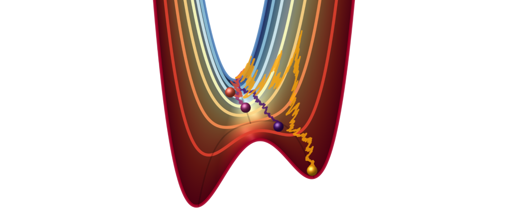

# RAD
Code for the Rescaled Auto-Density (RAD) in your favourite language

A summary of RAD can be found on [this gitbook page](https://time-series-features.gitbook.io/time-series-analysis-tools/time-series-features/rad).
Further details can be found in the original paper:
> [_"Tracking the distance to criticality in systems with unknown noise"_](https://arxiv.org/pdf/2310.14791)

